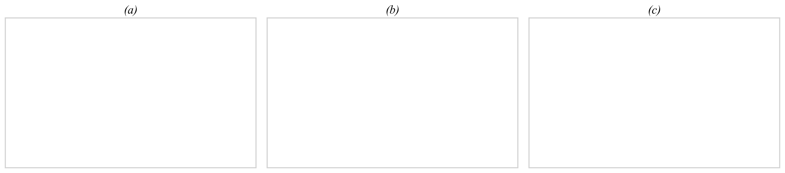
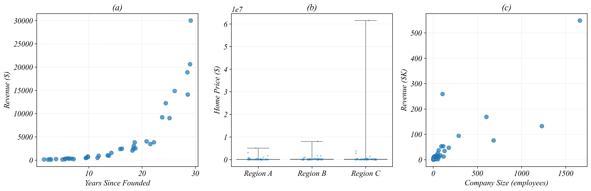
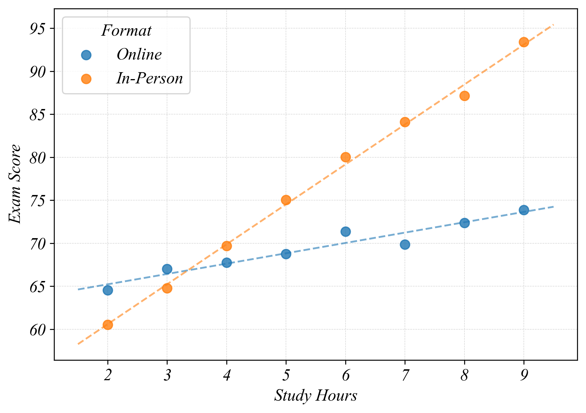

**Name: ________________________________________________________________________________________________________ **                          **Student ID: ________________________________________________________________________________________________________ **

## ECON 0150 | MiniExam 2 | Demo

MiniExams are designed to both test your knowledge and challenge you to apply familiar concepts in new environments. Treat it as if you're trying to show me that you understand the material. Answer clearly, completely, and concisely. Data tables are provided at the end.

#### Academic Conduct Code

The following academic conduct code is designed to protect the integrity of your work. Print your name/initials beside the three academic honesty agreements. I pledge to my fellow students, the university, and the instructor, that:

________ I will complete this MiniExam solely using my own work.
________ I will not use any digital resources unless explicitly allowed by the instructor.
________ I will not communicate directly or indirectly with others during the MiniExam.

##### Q1. Choose the Right Visualization (see Data 1a, 1b, 1c)

For each dataset, identify the variable types and draw the most appropriate Part 2 visualization.

a) **Data 1a** Variable Types: ______________________  b) **Data 1b** Variable Types: ______________________  c) **Data 1c** Variable Types: ______________________

##### Q2. Fix the Figure (see Data 2)

The three figures in Data 2 each have a problem that makes it hard to see patterns in the data. For each one, draw a better version of the figure *(in the boxes below)*. Clearly label your figure to make it clear what the improvement is.

##### Q3. Interpret Log Scales (no data needed)

a) On a log2 scale, each one-unit increase means the original value has:

[increased by 2]    [doubled]    [tripled]    [increased by 10]

b) On a log10 scale, each one-unit increase means the original value has:

[increased by 2]    [doubled]    [tripled]    [increased by 10]

c) Product A has log2(1 + Revenue) = 4. Product B has log2(1 + Revenue) = 7. The difference is 3 units. About how many times more revenue does B have than A?

[2 times]    [3 times]    [8 times]    [128 times]

##### Q4. Investigate and Visualize (see Data 4)

A nonprofit tracks shift data for its volunteers and employees. Data 4 shows each person's role, the day of their shift, and their shift pay. Volunteers are unpaid.

a) Visualize Shift_Pay grouped by Day using all the data in Data 4. b) Filter for employees only. Visualize Shift_Pay grouped by Day for employees only.

##### Q5. Interpret a Scatter Plot by Category (see Data 5)

a) As Study Hours increase, what happens to Exam Score for Online students?

b) As Study Hours increase, what happens to Exam Score for In-Person students?

c) Which group benefits more from additional study hours? 

## Datasets

### Data 1a: Restaurant Tips by Meal Type
| Customer | Meal   | Tip ($) |
|----------|--------|---------|
| C1       | Lunch  | 4       |
| C2       | Dinner | 12      |
| C3       | Lunch  | 5       |
| C4       | Dinner | 15      |
| C5       | Lunch  | 3       |
| C6       | Dinner | 10      |

### Data 1b: House Size and Price
| House | Sq_Feet | Price ($K) |
|-------|---------|------------|
| H1    | 800     | 180        |
| H2    | 1,200   | 250        |
| H3    | 1,500   | 310        |
| H4    | 2,000   | 420        |
| H5    | 2,500   | 530        |

### Data 1c: Study Hours, GPA, and Major
| Student | Major | Study_Hours | GPA |
|---------|-------|-------------|-----|
| S1      | STEM  | 3           | 2.8 |
| S2      | Arts  | 3           | 3.2 |
| S3      | STEM  | 6           | 3.1 |
| S4      | Arts  | 6           | 3.6 |
| S5      | STEM  | 9           | 3.5 |
| S6      | Arts  | 9           | 3.9 |

### Data 2: Three Visualizations

### Data 4: Nonprofit Shift Records
| Person_ID | Role      | Day     | Shift_Pay |
|-----------|-----------|---------|-----------|
| P01       | Volunteer | Weekday | 0         |
| P02       | Employee  | Weekday | 100       |
| P03       | Volunteer | Weekend | 0         |
| P04       | Employee  | Weekend | 160       |
| P05       | Volunteer | Weekday | 0         |
| P06       | Volunteer | Weekend | 0         |
| P07       | Employee  | Weekday | 130       |
| P08       | Volunteer | Weekend | 0         |
| P09       | Employee  | Weekend | 200       |
| P10       | Volunteer | Weekday | 0         |
| P11       | Volunteer | Weekend | 0         |
| P12       | Employee  | Weekday | 110       |
| P13       | Volunteer | Weekday | 0         |
| P14       | Employee  | Weekend | 180       |

### Data 5: Study Hours vs Exam Score by Format

