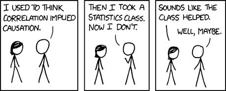
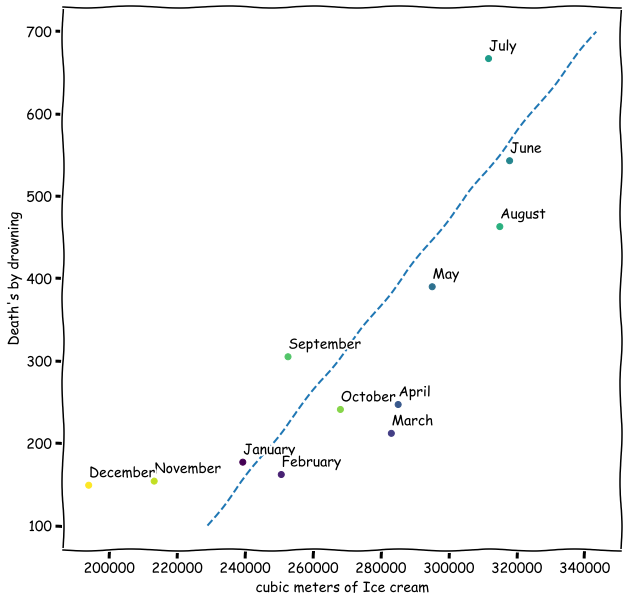
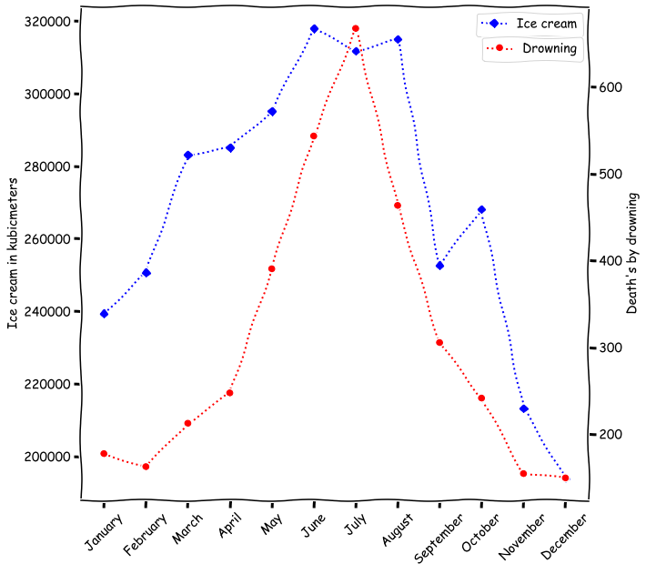
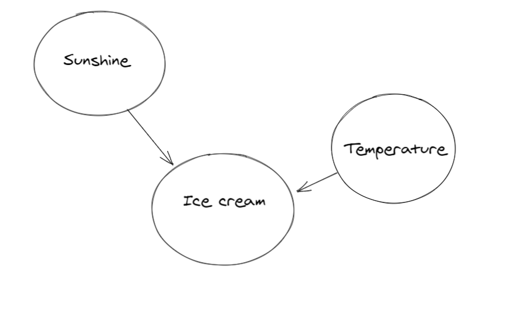

---
format:
  revealjs:
    css: custom.css
    transition: none
    aspect-ratio: "16:9"
---

## ECON 0150 | Economic Data Analysis {.center}
<p class="subheader-center">The economist's data analysis pipeline.</p>

<br>

### *Part 5.4 | Causation, Controls, and Model Selection*

---

## Today's Class
<p class="subheader">Causation, controls, and model selection</p>

1. Why controls matter: causation vs. correlation
2. How to compare models: R² and the F-test
3. How to choose a model: the model selection framework

<p style="text-align:center;"></p>

---

## Ice Cream Sales and Drowning Deaths
<p class="subheader">Monthly data from 12 months.</p>

{fig-align="center" width="60%"}

. . .

*As ice cream sales go up, so do drowning deaths ($\hat\beta_1$ = 3.4, p < 0.001)!*

. . .

***Q.** So ice cream causes drowning?*

---

## Three Possible Explanations
<p class="subheader">Correlation cannot tell us which explanation is right.</p>

. . .

1. **Direct Causation:** Ice Cream → Swimming → Drowning
<br>Eating ice cream makes people want to swim?

. . .

2. **Reverse Causation:** Drowning → Ice Cream Sales
<br>News of drownings drives sympathy ice cream consumption?

. . .

3. **Confounding:** Something else causes both

---

## Let's Look at the Timing
<p class="subheader">Both variables follow a seasonal pattern.</p>

{fig-align="center" width="30%"}

. . .

*Both ice cream sales and drowning deaths peak in summer months*

---

## The True Relationship
<p class="subheader">Season is the confounding variable driving both.</p>

<p style="text-align:center;"></p>

. . .

::: {.center}                                                                            
  *The relationship between ice cream and drowning is spurious.*                           
:::

---

## The Fix: Control Variables
<p class="subheader">Adding the confounder to the model removes the spurious relationship.</p>

**Simple model** (spurious relationship):

$$\text{Drownings} = \beta_0 + \beta_1 \cdot \text{IceCream} + \varepsilon$$

*$\beta_1 > 0$, highly significant*

. . .

<br><br>

**Controlled model** (add the confounder):

$$\text{Drownings} = \beta_0 + \beta_1 \cdot \text{IceCream} + \beta_2 \cdot \text{Temperature} + \varepsilon$$

*$\beta_1$ becomes insignificant, $\beta_2$ captures the real effect*

---

## This Is What The Homework Has Been Doing :)
<p class="subheader">The BRFSS homework arc is a causation story.</p>

<br>

| | Model | Control |
|:----|:---------------|:-------|
| HW 4.1 | BMI ~ unemployment_rate | Nothing |
| HW 5.1 | BMI ~ unemployment_rate + Female | Gender |
| HW 5.2 | BMI ~ unemployment_rate × Female | Gender × effect |
| HW 5.3 | BMI ~ unemployment_rate + Female + AGE + College + Married | Multiple |

<br>

*Each control removes a confounder from the unemployment-BMI relationship.*

---

## Controls Don't Guarantee Causation
<p class="subheader">Three problems remain, even after adding controls.</p>

. . .

**1. Omitted variable bias**

*There might be a confounder we didn't think of (diet, exercise, genetics...)*

. . .

**2. Reverse causality**

*Maybe poor health causes unemployment, not the other way around*

. . .

**3. Measurement error**

*BMI in BRFSS is self-reported, so systematic misreporting could bias results*

. . .

<br><br>

*Controls help, but they can't prove causation on their own.*

---

## Model Comparison
<p class="subheader">How do we know if adding controls improves the model?</p>

<br>

We need tools to *compare* models:

- **R²**: How much variation does the model explain?
- **F-test**: Is the improvement statistically significant?

---

## R²: Proportion of Variation Explained
<p class="subheader">How much of the variation does our model capture?</p>

$$R^2 = 1 - \frac{SSE}{SST}$$

. . .

- $SST$: total variation (SSE of the mean-only model)
- $SSE$: leftover variation after fitting the model

. . .

<br>

$R^2$ measures how much of the variability in the data is captured by the model.

- $R^2 = 0$: model does no better than the mean
- $R^2 = 1$: model predicts perfectly

. . .

***Q.** Is a higher $R^2$ always better?*

---

## The Problem with R²: Overfitting
<p class="subheader">R² always goes up when you add variables.</p>

***Q.** Which of these three models of income do you think is best?*

```{python}
#| echo: false
#| fig-align: center
import numpy as np
import matplotlib.pyplot as plt
import seaborn as sns
from scipy import stats

plt.rcParams.update({
    'font.family': 'serif',
    'font.serif': ['Times New Roman'],
    'font.style': 'italic',
})

# Simulated R² values for nested models
models = ['income ~ 1\n(null)', 'income ~ age', 'income ~ age + educ', 'income ~ age + educ + eye_color']
r2_values = [0.0, 0.12, 0.38, 0.39]
colors = ['#4C72B0', '#4C72B0', '#4C72B0', '#4C72B0']

fig, ax = plt.subplots(figsize=(10, 4))
bars = ax.bar(models, r2_values, color=colors, edgecolor='white', width=0.6)

ax.set_ylabel('R²', fontsize=14)
ax.set_ylim(0, 0.5)
ax.set_yticks([0, 0.1, 0.2, 0.3, 0.4, 0.5])

# Add value labels on bars
for bar, val in zip(bars, r2_values):
    ax.text(bar.get_x() + bar.get_width()/2, bar.get_height() + 0.015,
            f'{val:.2f}', ha='center', fontsize=12)

# Add annotation for the noise variable
ax.annotate('eye color \n increases R²',
            xy=(2.8, 0.39), xytext=(2.32, 0.45),
            fontsize=11, color='#DD8452',
            arrowprops=dict(arrowstyle='->', color='#DD8452'))

sns.despine(left=False, bottom=False, right=True, top=True)
ax.tick_params(bottom=False)
plt.tight_layout()
plt.show()
```

---

## The Problem with R²: Overfitting
<p class="subheader">R² always goes up when you add variables.</p>

***Q.** Which of these three models of income do you think is best?*

```{python}
#| echo: false
#| fig-align: center
import numpy as np
import matplotlib.pyplot as plt
import seaborn as sns
from scipy import stats

plt.rcParams.update({
    'font.family': 'serif',
    'font.serif': ['Times New Roman'],
    'font.style': 'italic',
})

# Simulated R² values for nested models
models = ['income ~ 1\n(null)', 'income ~ age', 'income ~ age + educ', 'income ~ age + educ + noise']
r2_values = [0.0, 0.12, 0.38, 0.39]
colors = ['#4C72B0', '#4C72B0', '#4C72B0', '#4C72B0']

fig, ax = plt.subplots(figsize=(10, 4))
bars = ax.bar(models, r2_values, color=colors, edgecolor='white', width=0.6)

ax.set_ylabel('R²', fontsize=14)
ax.set_ylim(0, 0.5)
ax.set_yticks([0, 0.1, 0.2, 0.3, 0.4, 0.5])

# Add value labels on bars
for bar, val in zip(bars, r2_values):
    ax.text(bar.get_x() + bar.get_width()/2, bar.get_height() + 0.015,
            f'{val:.2f}', ha='center', fontsize=12)

# Add annotation for the noise variable
ax.annotate('random noise \n increases R²!',
            xy=(2.8, 0.39), xytext=(2.32, 0.45),
            fontsize=11, color='#DD8452',
            arrowprops=dict(arrowstyle='->', color='#DD8452'))

sns.despine(left=False, bottom=False, right=True, top=True)
ax.tick_params(bottom=False)
plt.tight_layout()
plt.show()
```

:::{.incremental}
- *Adding random noise will improve $R^2$ a little.*
- ***Overfitting**: the model is fitting the noise, not the signal.*
- *How do we know if the improvement is due to noise?*
:::

---

## What happens when we add noise?
<p class="subheader">Lets add two random variables to a model and see what happens to R².</p>

```{python}
#| echo: false
#| fig-align: center
np.random.seed(42)
n = 100

# True model: income depends on age
age = np.random.uniform(22, 65, n)
income = 20 + 0.5 * age + np.random.normal(0, 10, n)

# Restricted model R²
from sklearn.linear_model import LinearRegression
r2_restricted = LinearRegression().fit(age.reshape(-1,1), income).score(age.reshape(-1,1), income)

# 8 samples of adding pure noise
fig, axes = plt.subplots(2, 4, figsize=(11, 4), sharey=True)
for i, ax in enumerate(axes.flat):
    noise1 = np.random.normal(0, 1, n)
    noise2 = np.random.normal(0, 1, n)
    X_full = np.column_stack([age, noise1, noise2])
    r2_full = LinearRegression().fit(X_full, income).score(X_full, income)
    improvement = r2_full - r2_restricted

    ax.bar(['Restricted', 'Full'], [r2_restricted, r2_full],
           color=['white', '#4C72B0'], edgecolor='#4C72B0', width=0.6)
    ax.set_title(f'$\Delta R^2$ = {improvement:.4f}', fontsize=9)
    ax.set_ylim(0, 0.45)
    ax.set_yticks([])
    ax.set_ylabel('R²', fontsize=10)
    ax.tick_params(labelsize=7, bottom=False)
    sns.despine(ax=ax, bottom=False, right=True, top=True)

plt.tight_layout()
plt.show()
```

. . .

*Every time we add noise, R² goes up a little. But only a little.*

---

## What happens when we do this 1,000 times?
<p class="subheader">The distribution of R² improvements from adding noise.</p>

. . .

```{python}
#| echo: false
#| fig-align: center
np.random.seed(42)
n = 100
k = 1   # one noise variable added
p = 3   # parameters in full model

# Generate one dataset
age = np.random.uniform(22, 65, n)
educ = np.random.uniform(8, 20, n)
income = 10 + 0.3 * age + 1.5 * educ + np.random.normal(0, 8, n)
r2_base = LinearRegression().fit(age.reshape(-1,1), income).score(age.reshape(-1,1), income)

# Simulate 1000 noise additions
null_f_stats = []
for _ in range(1000):
    noise = np.random.normal(0, 1, n)
    X_noise = np.column_stack([age, noise])
    r2_noise = LinearRegression().fit(X_noise, income).score(X_noise, income)
    f_null = ((r2_noise - r2_base) / k) / ((1 - r2_noise) / (n - p))
    null_f_stats.append(f_null)

fig, ax = plt.subplots(figsize=(10, 4))
ax.hist(null_f_stats, bins=40, alpha=0.6, color='#4C72B0', edgecolor='white', density=True)
ax.set_xlabel('F statistic (size of R² improvement relative to noise)', fontsize=13)
ax.set_yticks([])
ax.set_ylabel('')

sns.despine(left=True, bottom=False, right=True, top=True, trim=True)
plt.tight_layout()
plt.show()
```

. . .

*Most improvements are tiny. Large improvements from noise are rare.*

---

## The F-statistic
<p class="subheader">Measuring the size of the R² improvement relative to noise.</p>

$$F = \frac{(R^2_F - R^2_R) / k}{(1 - R^2_F) / (n - p)}$$

:::{.incremental}
- $R^2_R$: R² of the restricted model (fewer variables)
- $R^2_F$: R² of the full model (more variables)
- $k$: number of variables added
- $n - p$: remaining degrees of freedom
:::

. . .

***Numerator:** average R² gain per variable.* 

***Denominator:** average unexplained variation.*

---

## The F-distribution
<p class="subheader">Our simulation matches a known distribution.</p>

```{python}
#| echo: false
#| fig-align: center

fig, ax = plt.subplots(figsize=(10, 4))
ax.hist(null_f_stats, bins=40, alpha=0.4, color='#4C72B0', edgecolor='white',
        density=True, label='Simulated null (1,000 noise samples)')

# Overlay theoretical F-distribution
x_f = np.linspace(0, max(null_f_stats)*1.2, 500)
y_f = stats.f.pdf(x_f, k, n - p)
ax.plot(x_f, y_f, color='green', linestyle='--', linewidth=2, label='F-distribution')

ax.set_xlabel('F statistic', fontsize=13)
ax.set_yticks([])
ax.set_ylabel('')
ax.legend(fontsize=10)

sns.despine(left=True, bottom=False, right=True, top=True, trim=True)
plt.tight_layout()
plt.show()
```

. . .

<br>

1. The t-distribution described sampling variation in slopes. 
2. The F-distribution describes sampling variation in R² improvements.

---

## Testing Noise
<p class="subheader">Does adding eye color to the income model improve it?</p>

```{python}
#| echo: false
#| fig-align: center

# The overfitting example model: income ~ age + educ
X_base = np.column_stack([age, educ])
r2_full = LinearRegression().fit(X_base, income).score(X_base, income)

# Add noise (eye color)
np.random.seed(7)
noise_test = np.random.normal(0, 1, n)
X_with_noise = np.column_stack([age, educ, noise_test])
r2_with_noise = LinearRegression().fit(X_with_noise, income).score(X_with_noise, income)
noise_improvement = r2_with_noise - r2_full

k_noise = 1
p_noise = 4
f_noise = ((r2_with_noise - r2_full) / k_noise) / ((1 - r2_with_noise) / (n - p_noise))
p_value_noise = 1 - stats.f.cdf(f_noise, k_noise, n - p_noise)

fig, ax = plt.subplots(figsize=(8, 4))
ax.bar(['income ~ age + educ', 'income ~ age + educ + eye color'],
       [r2_full, r2_with_noise],
       color=['#4C72B0', '#DD8452'], edgecolor='white', width=0.5)
ax.set_ylabel('R²', fontsize=14)
ax.set_ylim(0, max(r2_with_noise * 1.3, 0.5))
for i, val in enumerate([r2_full, r2_with_noise]):
    ax.text(i, val + 0.005, f'{val:.4f}', ha='center', fontsize=12)
ax.text(0.5, (r2_full + r2_with_noise) / 2, f'$\Delta R^2$ = {noise_improvement:.4f}',
        ha='center', fontsize=10, color='red')
ax.tick_params(bottom=False)
sns.despine(ax=ax, left=False, bottom=False, right=True, top=True)
plt.tight_layout()
plt.show()
```

. . .

*R² went up. But is this improvement real?*

---

## Testing Noise
<p class="subheader">Where does eye color land on the F-distribution?</p>

```{python}
#| echo: false
#| fig-align: center

fig, ax = plt.subplots(figsize=(10, 4))

# F-distribution curve
x_f = np.linspace(0, 8, 500)
y_f = stats.f.pdf(x_f, k_noise, n - p_noise)
ax.plot(x_f, y_f, color='#4C72B0', linewidth=2)
ax.fill_between(x_f, 0, y_f, alpha=0.1, color='#4C72B0')

# Shade p-value region
x_pval = np.linspace(f_noise, 8, 200)
y_pval = stats.f.pdf(x_pval, k_noise, n - p_noise)
ax.fill_between(x_pval, 0, y_pval, color='red', alpha=0.3)

# Mark observed F
ax.axvline(x=f_noise, color='red', linestyle='--', linewidth=2)
ax.text(f_noise + 0.2, max(y_f) * 0.5,
        f'F = {f_noise:.2f}',
        fontsize=11, color='red')
ax.set_xlabel('F statistic', fontsize=13)
ax.set_xlim(left=0)
ax.set_ylim(bottom=0)
ax.set_yticks([])

sns.despine(ax=ax, left=False, bottom=False, right=True, top=True)
plt.tight_layout()
plt.show()
```

. . .

```{python}
#| echo: false
print(f"F-statistic: {f_noise:.2f}")
print(f"p-value: {p_value_noise:.3f}")
```

. . .

*Large p-value. The improvement is just overfitting.*

---

## Testing Noise
<p class="subheader">Where does eye color land on the F-distribution?</p>

```{python}
#| echo: false
print(f"F-statistic: {f_noise:.2f}")
print(f"p-value: {p_value_noise:.3f}")
```

*Large p-value. The improvement is just overfitting.*

. . .

<br><br> 

We could also check the t-test on the noise coefficient:

```{python}
#| echo: false
import pandas as pd
import statsmodels.formula.api as smf

df_sim = pd.DataFrame({'income': income, 'age': age, 'educ': educ, 'noise': noise_test})
noise_ols = smf.ols('income ~ age + educ + noise', data=df_sim).fit()
print(noise_ols.summary().tables[1])
```

. . .

<br>

*Both the t-test and the F-test agree: noise doesn't help.*

---

## But what about multiple variables?
<p class="subheader">Can we use the t-test to ask whether age and education jointly improve the model?</p>

. . .

The t-test checks one coefficient at a time. It can tell us:

- Does age matter? (test $\beta_1$)
- Does education matter? (test $\beta_2$)

. . .

But it can't tell us: do age and education *together* improve the model?

---

## Testing the Full Model
<p class="subheader">Do age and education together improve predictions?</p>

```{python}
#| echo: false
#| fig-align: center

# Test: does the full model (age + educ) beat the null?
r2_null = 0.0
X_full = np.column_stack([age, educ])
r2_full = LinearRegression().fit(X_full, income).score(X_full, income)
real_improvement = r2_full - r2_null

k_full = 2
p_full = 3
f_obs = ((r2_full - r2_null) / k_full) / ((1 - r2_full) / (n - p_full))
p_value_obs = 1 - stats.f.cdf(f_obs, k_full, n - p_full)

fig, ax = plt.subplots(figsize=(8, 4))
ax.bar(['income ~ 1\n(null)', 'income ~ age + educ'],
       [r2_null, r2_full],
       color=['#4C72B0', '#55A868'], edgecolor='white', width=0.5)
ax.set_ylabel('R²', fontsize=14)
ax.set_ylim(0, max(r2_full * 1.3, 0.5))
for i, val in enumerate([r2_null, r2_full]):
    ax.text(i, val + 0.005, f'{val:.3f}', ha='center', fontsize=12)
ax.annotate('', xy=(1, r2_full), xytext=(1, r2_null),
            arrowprops=dict(arrowstyle='<->', color='red', lw=2))
ax.text(1.3, r2_full / 2, f'$\Delta R^2$ = {real_improvement:.3f}',
        fontsize=10, color='red')
ax.tick_params(bottom=False)
sns.despine(ax=ax, left=False, bottom=False, right=True, top=True)
plt.tight_layout()
plt.show()
```

---

## Testing the Full Model
<p class="subheader">Where does the full model land on the F-distribution?</p>

```{python}
#| echo: false
#| fig-align: center

fig, ax = plt.subplots(figsize=(10, 4))

# F-distribution curve
x_f = np.linspace(0, f_obs * 1.3, 500)
y_f = stats.f.pdf(x_f, k_full, n - p_full)
ax.plot(x_f, y_f, color='#4C72B0', linewidth=2)
ax.fill_between(x_f, 0, y_f, alpha=0.1, color='#4C72B0')

# Shade p-value region
x_pval = np.linspace(f_obs, f_obs * 1.3, 200)
y_pval = stats.f.pdf(x_pval, k_full, n - p_full)
ax.fill_between(x_pval, 0, y_pval, color='red', alpha=0.3)

# Mark observed F
ax.axvline(x=f_obs, color='red', linestyle='--', linewidth=2)
ax.text(f_obs * 0.92, max(y_f) * 0.6,
        f'F = {f_obs:.1f}',
        fontsize=11, color='red', ha='right')
ax.set_xlabel('F statistic', fontsize=13)
ax.set_xlim(left=0)
ax.set_ylim(bottom=0)
ax.set_yticks([])

sns.despine(ax=ax, left=False, bottom=False, right=True, top=True)
plt.tight_layout()
plt.show()
```

. . .

```{python}
#| echo: false
print(f"F-statistic: {f_obs:.2f}")
print(f"p-value: {p_value_obs:.6f}")
```

*Age and education together significantly improve the model.*

---

## Model Selection Framework
<p class="subheader">The research question determines the model.</p>

| Question Type | Model |
|-------|---------|
| Change in single group | $y = \beta_0 + \varepsilon$ (*One-sample t-test*) |
| Differences between groups |  $y = \beta_0 + \beta_1 Group + \varepsilon$ (*Two-sample t-test*) |
| Relationship between vars | $y = \beta_0 + \beta_1 x + \varepsilon$ (*Simple regression*) |
| Multiple factors | $y = \beta_0 + \beta_1 x_1 + \beta_2 x_2 + \varepsilon$ (*Multiple reg*) |
| Group-specific relationships | $y = \beta_0 + \beta_1 x + \beta_2 Group + \beta_3 x \times Group + \varepsilon$ <br> (*Interactions*) |
| Temporal patterns | $y_t = \beta_0 + \beta_1 t + \beta_2 Season + \varepsilon_t$ <br> (*Time series with fixed effects*) |
| Many more! | (*You can construct your own*) |

---

## Practice: Which Model?
<p class="subheader">For each question, identify the model type and write the equation.</p>

. . .

**(a)** Did average household income change after a new factory opened?

. . .

$$\text{income_change} = \beta_0 + \varepsilon$$

. . .

**(b)** Does the effect of study hours on GPA differ for STEM vs. non-STEM majors?

. . .

$$\text{GPA} = \beta_0 + \beta_1 \text{hours} + \beta_2 \text{STEM} + \beta_3 \text{hours} \times \text{STEM} + \varepsilon$$

. . .

**(c)** Is there a relationship between commute time and job satisfaction, controlling for salary?

. . .

$$\text{satisfaction} = \beta_0 + \beta_1 \text{commute} + \beta_2 \text{salary} + \varepsilon$$

---

## Summary
<p class="subheader">Main ideas about causation, controls, and model selection</p>

<br>

:::{.incremental}
1. **Start with the question** — What is the causal story? What confounders exist?
2. **Visualize** — Patterns reveal what model to use
3. **Choose the right model** — Match the question to the framework
4. **Add controls** — Remove potential confounders
5. **Compare models** — Use R² and F-tests to evaluate
6. **Interpret with caution** — Controls help, but don't prove causation
:::
